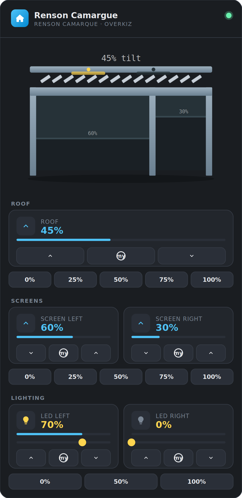

# 🌿 Renson Camargue Pergola Card

> **This integration was fully generated with [Claude](https://claude.ai) by Anthropic.**

[](https://github.com/hacs/integration)
[](https://www.home-assistant.io)
[](https://www.buymeacoffee.com/AndriesMuylaert)

A Home Assistant Lovelace custom card for the **Renson Camargue** pergola, using the [OverKiz](https://www.home-assistant.io/integrations/overkiz/) integration.

## Features

- **Live SVG visual** of the pergola: louvres animate based on actual tilt %, screens drop to their real position, LED panels glow when on.
- **Roof louvres** — open tilt / My (stop) / close tilt with live % readout.
- **Quick-set roof tilt** — one-tap buttons to set the roof tilt to 0 / 25 / 50 / 75 / 100 %.
- **Screen left & right** — open / My (stop) / close with live % readout.
- **Quick-set both screens** — one-tap buttons to set left & right screens together to 0 / 25 / 50 / 75 / 100 %.
- **LED left & right** — on / My (preferred position) / off buttons, plus a position slider (`number` entity) with live readout.
- **Quick-set both LEDs** — one-tap buttons for left & right LEDs together: Off, My preset (~50%), or fully On.
- Fully dark-themed, designed to blend with modern HA dashboards.
- Tap-friendly buttons with no lingering hover/tap highlight on mobile.

## Preview



> Rendered directly from this card's own layout and colors, with sample data (roof tilt 45%, screens at 60%/30%, one LED on). The card renders a simplified front-perspective SVG of the Camarque structure — louvre angle, screen drop level, and LED glow all update in real time from your actual entity states. Quick-set rows sit just below the standard buttons for the Roof, Screens, and Lighting sections.

## Installation

### Via HACS (recommended)

1. Open **HACS → Frontend**.
2. Click the **⋮ menu → Custom repositories**.
3. Add `https://github.com/AndriesMuylaert/Outdoor-living` with category **Lovelace**.
4. Find **Renson Camargue Pergola Card** and click **Download**.
5. Reload your browser.

### Manual

1. Download `renson-pergola-card.js` from the [latest release](https://github.com/AndriesMuylaert/outdoor-living/releases).
2. Copy it to `config/www/renson-pergola-card.js`.
3. In HA → **Settings → Dashboards → Resources**, add:
   ```
   /local/renson-pergola-card.js   (JavaScript module)
   ```
4. Reload your browser.

## Configuration

Add a card in Lovelace with type `custom:renson-pergola-card`:

```yaml
type: custom:renson-pergola-card
name: Renson Camargue     # optional, default "Renson Camargue"
roof_cover: cover.camargue_roof
screen_left: cover.camargue_screen_left
screen_right: cover.camargue_screen_right
led_left: light.camargue_led_left
led_right: light.camargue_led_right
led_left_slider: number.camargue_led_li_my_position
led_right_slider: number.camargue_led_rec_my_position
led_left_button: button.camargue_led_li_my_position
led_right_button: button.camargue_led_rec_my_position
```

### Entity IDs with OverKiz

OverKiz entity IDs are auto-generated from the device names you configured in the Somfy/Renson app. Open **Developer Tools → States** and search for your devices to find the exact IDs. Common patterns:

| Device | Typical entity ID |
|---|---|
| Roof (louvres) | `cover.camargue_roof` |
| Left screen | `cover.camargue_screen_left` |
| Right screen | `cover.camargue_screen_right` |
| LED left | `light.camargue_led_left` |
| LED right | `light.camargue_led_right` |
| LED left position (number) | `number.camargue_led_li_my_position` |
| LED right position (number) | `number.camargue_led_rec_my_position` |
| LED left My button | `button.camargue_led_li_my_position` |
| LED right My button | `button.camargue_led_rec_my_position` |

## Controls reference

| Control | Open/On | Stop (My) | Close/Off |
|---|---|---|---|
| Roof | `cover.open_cover_tilt` | `cover.stop_cover_tilt` | `cover.close_cover_tilt` |
| Screens | `cover.open_cover` | `cover.stop_cover` | `cover.close_cover` |
| LEDs | `light.turn_on` | `button.press` (My position) | `light.turn_off` |
| LED position | `number.set_value` via slider | — | — |

The **My** button sends the OverKiz "preferred position" stop command — works if you have a My position programmed in the Renson / Somfy app.

### Quick-set

Below the individual Roof and Screens controls, a row of five buttons (`0% / 25% / 50% / 75% / 100%`) lets you jump straight to a value in a single tap. The Lighting quick-set row only has three buttons (`0% / 50% / 100%`) — see note below.

| Row | Action |
|---|---|
| Roof quick-set | Calls `cover.set_cover_tilt_position` with the chosen `tilt_position` on `roof_cover`. |
| Screens quick-set | Calls `cover.set_cover_position` with the chosen `position` on `screen_left` and `screen_right` simultaneously. |
| LEDs quick-set (0%) | Calls `light.turn_off` on `led_left` and `led_right`. |
| LEDs quick-set (50%) | Calls `button.press` on `led_left_button` and `led_right_button` — this presses the physical "My" preset, which is the only reliable way to reach a dimmed (non-0/100%) level on this hardware. |
| LEDs quick-set (100%) | Calls `light.turn_on` on `led_left` and `led_right`. |

> **Why only 3 LED buttons?** The LED position `number` entity doesn't actually drive real-time dimming on the Camargue hardware — testing showed the physical remote only produces a distinguishable brightness change via its "My" button (a hardware-programmed preset, typically around 50%), with On/Off being the only other reliable states. A 25%/75% quick-set button would just silently do nothing, so those were removed.

## Touch/mobile behavior

Buttons only react while pressed (no hover glow), and no highlight or outline lingers after you lift your finger/release the mouse — this avoids the "stuck blue glow" some mobile browsers show on tap.

## Visual status levels

The SVG renders snapped visual positions at 0 / 25 / 50 / 75 / 100 %, while the readout always shows the precise value reported by HA.

## Requirements

- Home Assistant **2023.1** or newer
- [OverKiz](https://www.home-assistant.io/integrations/overkiz/) integration configured
- Renson Camarque connected via Somfy TaHoma / OverKiz hub

## Credits

This integration was fully generated with **[Claude](https://claude.ai)** by [Anthropic](https://www.anthropic.com).

## License

MIT
